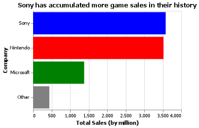
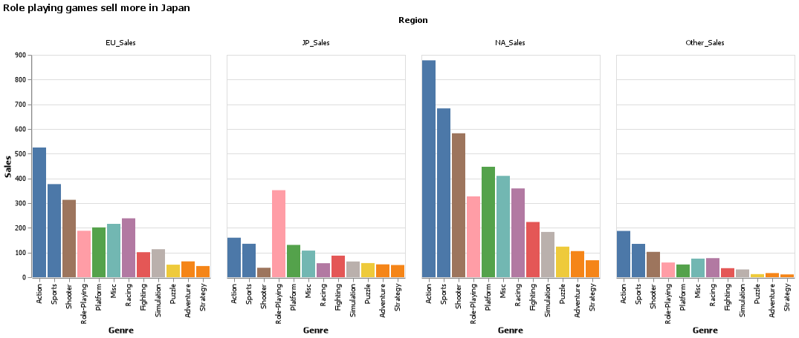

# Overview

I have a primary interest in back-end development, functional programming, and working in teams to solve technical problems and build software. As I develop these skills and learn various languages, I become qualified for a career in computing when I graduate BYU Idaho with a major in Computer Science.

The dataset being analyzed is video games sales data from over 16,500 different games across platforms from 1980 to 2015. Each row has a game with its sales rank, name, platform, release year, genre, publisher, sales by region (North America/Europe/Japan/Other), and total global sales. Sales are counted by millions.

[Video Game Sales dataset](https://www.kaggle.com/datasets/gregorut/videogamesales)

With pandas and altair, this dataset can be altered, filtered, and presented to answer how factors such as platform holder and region affect game sales.

[Software Demo Video](https://youtu.be/rC3vUpc-GYc)

# Data Analysis Results

## Question 1: Which console manufacturer (Nintendo/Sony/Microsoft/Other) has the greater overall software sales when all their platforms are combined?

Despite Nintendo having more platforms, Sony has sold slightly more software overall with a total of over 3.58 million units. This is more than sales from Microsoft and other companies combined.

## Question 2: How does region affect how games sell by their genre?

In most regions, action, sports, and shooter games are the most popular, selling more than other genres. In Japan however, role-playing games are notiecably the most popular by far, and shooters sell the least of the major genres.

# Development Environment

This software was written in VSCode and debugged with the Jupyter extension.

Pandas was used to manipulate data while Altair was used to create and render charts.

# Useful Websites

* [Kaggle](https://www.kaggle.com/)
* [Pandas](https://pandas.pydata.org/)
* [Vega-Altair](https://altair-viz.github.io)

# Future Work

* Answer a question relating to game publisher.
* Tweak altair charts to be more presentable/easier to read.